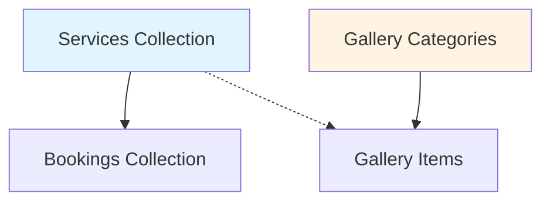

# Test Data Seed Generation Plan

**Plan ID**: 260116-2059-test-data-seed
**Date**: 2026-01-16
**Status**: Ready for Implementation
**Estimated Duration**: 2-3 hours

---

## Executive Summary

Create comprehensive realistic test data for Pink Nail Salon database covering 4 features: Gallery (with categories), Bookings, Contacts, and Banners. Generate 20-50 records per feature using realistic Vietnamese nail salon data. Implement dual approach: MongoDB seed script for fast insertion + API verification.

---

## Scope

### Features Included
1. **Gallery Categories** (6-8 categories) - Foundation for gallery items
2. **Gallery Items** (30-50 photos) - Nail art showcase with categories
3. **Bookings** (30-50 appointments) - Customer bookings with various statuses
4. **Contacts** (30-50 messages) - Contact form submissions
5. **Banners** (20-30 banners) - Homepage hero banners (image + video)

### Data Quality Requirements
- **Realistic Vietnamese nail salon context**
- Proper Vietnamese names (first/last)
- Valid Vietnamese phone formats: `(+84|0)(3|5|7|8|9)XXXXXXXX`
- Real San Francisco Bay Area addresses
- Authentic nail service terminology
- Varied statuses (new, pending, confirmed, completed, cancelled, etc.)
- Temporal distribution (last 90 days)

### Method
**Dual Approach**:
1. **Primary**: MongoDB seed script (`apps/api/src/seeds/seed-test-data.ts`)
   - Direct MongoDB insertion via Mongoose
   - Fast execution (<5 seconds for all data)
   - Idempotent with `--drop` flag option
   - Transaction support for consistency

2. **Verification**: API endpoint validation
   - GET endpoints to verify data integrity
   - Validate relationships (bookings→services, gallery→categories)
   - Check business logic (unique constraints, validations)

---

## Dependencies Analysis

### Database Schema Dependencies



**Dependency Chain**:
1. **Services** - Must exist first (referenced by Bookings)
2. **Gallery Categories** - Must exist first (referenced by Gallery)
3. **Bookings** - Requires Services
4. **Gallery** - Requires Gallery Categories (optional)
5. **Contacts** - Independent
6. **Banners** - Independent

### Existing Data Check
Need to verify if Services already exist in database:
- If YES: Use existing Service IDs for Bookings
- If NO: Create 15-20 realistic nail services first

---

## Data Structure Design

### 1. Gallery Categories (6-8 records)

```typescript
{
  name: string;           // "Manicure", "Pedicure", "Nail Art"
  slug: string;           // "manicure", "pedicure", "nail-art"
  description?: string;   // Optional description
  sortIndex: number;      // 0-7 for ordering
  isActive: boolean;      // true
}
```

**Categories**:
1. Manicure (Classic & Gel)
2. Pedicure (Spa & Luxury)
3. Nail Art (Creative Designs)
4. Extensions (Acrylic & Dip)
5. Special Occasions (Weddings, Events)
6. Seasonal Collections (Holiday themes)

### 2. Gallery Items (30-50 records)

```typescript
{
  imageUrl: string;         // Cloudinary or placeholder URL
  title: string;            // "French Manicure", "Ombre Nails"
  description?: string;     // Optional detail
  categoryId: ObjectId;     // Reference to GalleryCategory
  price?: string;           // "$45", "$60-80" (optional)
  duration?: string;        // "45 min", "1.5 hrs" (optional)
  featured: boolean;        // 10-15 featured items
  isActive: boolean;        // true
  sortIndex: number;        // 0-49
}
```

**Distribution**:
- Manicure: 8-10 items
- Pedicure: 8-10 items
- Nail Art: 10-12 items (most popular)
- Extensions: 6-8 items
- Special Occasions: 4-6 items
- Seasonal: 4-6 items

### 3. Bookings (30-50 records)

```typescript
{
  serviceId: ObjectId;      // Reference to Service
  date: Date;               // Last 90 days + next 30 days
  timeSlot: string;         // "09:00", "10:00", ..., "18:00"
  customerInfo: {
    firstName: string;      // Vietnamese first name
    lastName: string;       // Vietnamese last name
    email: string;          // firstname.lastname@example.com
    phone: string;          // Vietnamese format
  };
  notes?: string;           // Optional customer notes
  status: string;           // pending, confirmed, completed, cancelled
}
```

**Status Distribution**:
- `completed`: 60% (past dates)
- `confirmed`: 15% (upcoming dates)
- `pending`: 15% (recent bookings)
- `cancelled`: 10% (various dates)

**Temporal Distribution**:
- Past 90 days: 70% (completed/cancelled)
- Next 30 days: 30% (pending/confirmed)

### 4. Contacts (30-50 records)

```typescript
{
  firstName: string;        // Vietnamese first name
  lastName: string;         // Vietnamese last name
  email: string;            // firstname.lastname@example.com
  phone?: string;           // Optional Vietnamese phone
  subject: string;          // Realistic inquiry subjects
  message: string;          // Detailed customer message
  status: string;           // new, read, responded, archived
  adminNotes?: string;      // Optional admin response
  respondedAt?: Date;       // Set if status = responded
}
```

**Status Distribution**:
- `new`: 20% (recent submissions)
- `read`: 25% (viewed but not responded)
- `responded`: 40% (with adminNotes and respondedAt)
- `archived`: 15% (old resolved inquiries)

**Subject Categories**:
- Booking inquiries (30%)
- Service questions (25%)
- Pricing information (20%)
- Complaints/feedback (15%)
- General inquiries (10%)

### 5. Banners (20-30 records)

```typescript
{
  title: string;            // Banner title/description
  imageUrl: string;         // Cloudinary URL or placeholder
  videoUrl?: string;        // YouTube/Cloudinary video (10% of banners)
  type: string;             // 'image' or 'video'
  isPrimary: boolean;       // Only 1 primary banner
  active: boolean;          // 80% active, 20% inactive
  sortIndex: number;        // 0-29 for ordering
}
```

**Distribution**:
- Image banners: 90% (27 records)
- Video banners: 10% (3 records)
- Primary: 1 record (isPrimary=true)
- Active: 80% (24 records)
- Inactive: 20% (6 records for testing)

---

## Realistic Data Sources

### Vietnamese Names (100+ combinations)

**First Names (Female)**:
- Linh, Mai, Hương, Ngọc, Lan, Thu, Hà, Trang, Anh, Phương
- Thảo, My, Hạnh, Nhung, Diệu, Kim, Loan, Quỳnh, Thanh, Trinh

**First Names (Male)**:
- Minh, Nam, Hùng, Tuấn, Dũng, Long, Hải, Khoa, Quang, Phúc
- Tài, Bình, Cường, Đức, Hoàng, Khánh, Sơn, Thành, Trung, Vinh

**Last Names**:
- Nguyễn (40%), Trần (12%), Lê (10%), Phạm (8%), Hoàng (7%)
- Phan, Vũ, Đặng, Bùi, Đỗ, Hồ, Ngô, Dương, Lý (remaining 23%)

### Phone Numbers
Format: `(+84|0)(3|5|7|8|9)XXXXXXXX`
- Mobile prefixes: 03, 05, 07, 08, 09
- Example: `0901234567`, `+84901234567`

### San Francisco Bay Area Addresses
```
123 Beauty Lane, San Francisco, CA 94102
456 Nail Art Avenue, Oakland, CA 94612
789 Spa Boulevard, San Jose, CA 95113
321 Salon Street, Berkeley, CA 94704
654 Pedicure Drive, Palo Alto, CA 94301
987 Manicure Way, Fremont, CA 94536
147 Polish Plaza, Hayward, CA 94541
258 Glam Court, Sunnyvale, CA 94086
369 Style Circle, Mountain View, CA 94043
741 Chic Lane, Redwood City, CA 94063
```

### Email Domains
- gmail.com (50%)
- yahoo.com (20%)
- outlook.com (15%)
- icloud.com (10%)
- hotmail.com (5%)

### Gallery Image Placeholders
Use placeholder services until real Cloudinary URLs available:
- `https://picsum.photos/800/600?random={1-50}` - Temporary
- Future: Upload to Cloudinary during seed

### Service Categories & Names
```typescript
const serviceData = [
  // Manicure (5 services)
  { name: "Classic Manicure", category: "manicure", price: 25, duration: 30 },
  { name: "Gel Manicure", category: "manicure", price: 40, duration: 45 },
  { name: "French Manicure", category: "manicure", price: 35, duration: 40 },
  { name: "Deluxe Manicure with Spa", category: "manicure", price: 50, duration: 60 },
  { name: "Express Manicure", category: "manicure", price: 20, duration: 20 },

  // Pedicure (5 services)
  { name: "Classic Pedicure", category: "pedicure", price: 35, duration: 45 },
  { name: "Gel Pedicure", category: "pedicure", price: 50, duration: 60 },
  { name: "Spa Pedicure Deluxe", category: "pedicure", price: 65, duration: 75 },
  { name: "Express Pedicure", category: "pedicure", price: 30, duration: 30 },
  { name: "Hot Stone Pedicure", category: "pedicure", price: 75, duration: 90 },

  // Nail Art (3 services)
  { name: "Custom Nail Art", category: "nail-art", price: 60, duration: 60 },
  { name: "Ombre Nails", category: "nail-art", price: 55, duration: 50 },
  { name: "3D Nail Design", category: "nail-art", price: 80, duration: 90 },

  // Extensions (4 services)
  { name: "Acrylic Full Set", category: "extensions", price: 70, duration: 90 },
  { name: "Acrylic Fill", category: "extensions", price: 45, duration: 60 },
  { name: "Dip Powder Full Set", category: "extensions", price: 65, duration: 75 },
  { name: "Gel Extension", category: "extensions", price: 80, duration: 90 },

  // Spa (2 services)
  { name: "Paraffin Wax Treatment", category: "spa", price: 15, duration: 20 },
  { name: "Hand & Foot Massage", category: "spa", price: 25, duration: 30 },
];
```

---

## Implementation Plan

### Phase 1: Setup & Utilities (30 min)

**File**: `apps/api/src/seeds/seed-test-data.ts`

Create seed script infrastructure:

```typescript
import { NestFactory } from '@nestjs/core';
import { AppModule } from '../app.module';
import { Logger } from '@nestjs/common';
import * as mongoose from 'mongoose';

const logger = new Logger('SeedTestData');

async function bootstrap() {
  const app = await NestFactory.createApplicationContext(AppModule);

  try {
    // Check for --drop flag
    const shouldDrop = process.argv.includes('--drop');

    if (shouldDrop) {
      logger.warn('Dropping existing data...');
      await dropCollections();
    }

    // Seed in dependency order
    await seedServices();           // Step 1: Services (needed by Bookings)
    await seedGalleryCategories();  // Step 2: Categories (needed by Gallery)
    await seedGallery();            // Step 3: Gallery items
    await seedBookings();           // Step 4: Bookings (requires Services)
    await seedContacts();           // Step 5: Contacts (independent)
    await seedBanners();            // Step 6: Banners (independent)

    logger.log('✅ Test data seeded successfully!');
  } catch (error) {
    logger.error('❌ Seed failed:', error);
    process.exit(1);
  } finally {
    await app.close();
  }
}

async function dropCollections() {
  const collections = [
    'services',
    'gallerycategories',
    'galleries',
    'bookings',
    'contacts',
    'banners'
  ];

  for (const collection of collections) {
    await mongoose.connection.db.dropCollection(collection).catch(() => {});
  }
}

bootstrap();
```

**File**: `apps/api/src/seeds/utils/data-generators.ts`

Create helper utilities:

```typescript
// Random selection helper
export function randomItem<T>(array: T[]): T {
  return array[Math.floor(Math.random() * array.length)];
}

// Random date within range
export function randomDate(start: Date, end: Date): Date {
  return new Date(start.getTime() + Math.random() * (end.getTime() - start.getTime()));
}

// Vietnamese name generator
export function generateVietnameseName() {
  const firstNames = ['Linh', 'Mai', 'Hương', 'Ngọc', 'Lan', /* ... */];
  const lastNames = ['Nguyễn', 'Trần', 'Lê', 'Phạm', 'Hoàng', /* ... */];

  return {
    firstName: randomItem(firstNames),
    lastName: randomItem(lastNames),
  };
}

// Vietnamese phone generator
export function generateVietnamesePhone(): string {
  const prefixes = ['090', '091', '093', '097', '098', '032', '033', '034'];
  const prefix = randomItem(prefixes);
  const suffix = Math.floor(Math.random() * 10000000).toString().padStart(7, '0');
  return `${prefix}${suffix}`;
}

// Email generator
export function generateEmail(firstName: string, lastName: string): string {
  const domains = ['gmail.com', 'yahoo.com', 'outlook.com', 'icloud.com'];
  const cleanFirst = firstName.toLowerCase().replace(/[^a-z]/g, '');
  const cleanLast = lastName.toLowerCase().replace(/[^a-z]/g, '');
  return `${cleanFirst}.${cleanLast}@${randomItem(domains)}`;
}
```

---

### Phase 2: Seed Services (20 min)

**File**: `apps/api/src/seeds/data/services.data.ts`

```typescript
export const servicesData = [
  // Manicure (5 services)
  {
    name: "Classic Manicure",
    description: "Traditional manicure with nail shaping, cuticle care, and polish application",
    category: "manicure",
    price: 25,
    duration: 30,
    featured: true,
    isActive: true,
  },
  {
    name: "Gel Manicure",
    description: "Long-lasting gel polish with LED curing for 2-3 weeks of shine",
    category: "manicure",
    price: 40,
    duration: 45,
    featured: true,
    isActive: true,
  },
  // ... (total 18 services)
];
```

**File**: `apps/api/src/seeds/seeders/services.seeder.ts`

```typescript
import { Injectable, Logger } from '@nestjs/common';
import { InjectModel } from '@nestjs/mongoose';
import { Model } from 'mongoose';
import { Service } from '../../modules/services/schemas/service.schema';
import { servicesData } from '../data/services.data';

@Injectable()
export class ServicesSeeder {
  private readonly logger = new Logger(ServicesSeeder.name);

  constructor(
    @InjectModel(Service.name) private serviceModel: Model<Service>,
  ) {}

  async seed(): Promise<Service[]> {
    this.logger.log('Seeding services...');

    const services = await this.serviceModel.insertMany(servicesData);

    this.logger.log(`✅ Created ${services.length} services`);
    return services;
  }
}
```

---

### Phase 3: Seed Gallery Categories & Items (30 min)

**File**: `apps/api/src/seeds/data/gallery-categories.data.ts`

```typescript
export const galleryCategoriesData = [
  {
    name: "Manicure",
    slug: "manicure",
    description: "Classic and gel manicure designs",
    sortIndex: 0,
    isActive: true,
  },
  {
    name: "Pedicure",
    slug: "pedicure",
    description: "Spa and luxury pedicure treatments",
    sortIndex: 1,
    isActive: true,
  },
  // ... (6-8 categories total)
];
```

**File**: `apps/api/src/seeds/seeders/gallery.seeder.ts`

```typescript
import { Injectable, Logger } from '@nestjs/common';
import { InjectModel } from '@nestjs/mongoose';
import { Model } from 'mongoose';
import { GalleryCategory } from '../../modules/gallery-category/schemas/gallery-category.schema';
import { Gallery } from '../../modules/gallery/schemas/gallery.schema';
import { galleryCategoriesData } from '../data/gallery-categories.data';

@Injectable()
export class GallerySeeder {
  private readonly logger = new Logger(GallerySeeder.name);

  constructor(
    @InjectModel(GalleryCategory.name) private categoryModel: Model<GalleryCategory>,
    @InjectModel(Gallery.name) private galleryModel: Model<Gallery>,
  ) {}

  async seedCategories(): Promise<GalleryCategory[]> {
    this.logger.log('Seeding gallery categories...');
    const categories = await this.categoryModel.insertMany(galleryCategoriesData);
    this.logger.log(`✅ Created ${categories.length} gallery categories`);
    return categories;
  }

  async seedGalleryItems(categories: GalleryCategory[]): Promise<Gallery[]> {
    this.logger.log('Seeding gallery items...');

    const items = [];
    let sortIndex = 0;

    for (const category of categories) {
      const itemCount = Math.floor(Math.random() * 5) + 6; // 6-10 items per category

      for (let i = 0; i < itemCount; i++) {
        items.push({
          title: `${category.name} Design ${i + 1}`,
          description: `Beautiful ${category.name.toLowerCase()} design showcasing our expertise`,
          imageUrl: `https://picsum.photos/800/600?random=${sortIndex}`,
          categoryId: category._id,
          price: Math.random() > 0.5 ? `$${Math.floor(Math.random() * 50) + 30}` : undefined,
          duration: Math.random() > 0.5 ? `${Math.floor(Math.random() * 3) + 1} hrs` : undefined,
          featured: Math.random() > 0.7, // 30% featured
          isActive: true,
          sortIndex: sortIndex++,
        });
      }
    }

    const gallery = await this.galleryModel.insertMany(items);
    this.logger.log(`✅ Created ${gallery.length} gallery items`);
    return gallery;
  }
}
```

---

### Phase 4: Seed Bookings (30 min)

**File**: `apps/api/src/seeds/seeders/bookings.seeder.ts`

```typescript
import { Injectable, Logger } from '@nestjs/common';
import { InjectModel } from '@nestjs/mongoose';
import { Model } from 'mongoose';
import { Booking } from '../../modules/bookings/schemas/booking.schema';
import { Service } from '../../modules/services/schemas/service.schema';
import {
  randomItem,
  randomDate,
  generateVietnameseName,
  generateVietnamesePhone,
  generateEmail
} from '../utils/data-generators';

@Injectable()
export class BookingsSeeder {
  private readonly logger = new Logger(BookingsSeeder.name);

  constructor(
    @InjectModel(Booking.name) private bookingModel: Model<Booking>,
    @InjectModel(Service.name) private serviceModel: Model<Service>,
  ) {}

  async seed(count: number = 40): Promise<Booking[]> {
    this.logger.log('Seeding bookings...');

    // Get all services
    const services = await this.serviceModel.find().exec();
    if (services.length === 0) {
      throw new Error('No services found. Seed services first.');
    }

    const bookings = [];
    const now = new Date();
    const pastDate = new Date(now.getTime() - 90 * 24 * 60 * 60 * 1000); // 90 days ago
    const futureDate = new Date(now.getTime() + 30 * 24 * 60 * 60 * 1000); // 30 days ahead

    const statuses = [
      { status: 'completed', weight: 24 },  // 60%
      { status: 'confirmed', weight: 6 },   // 15%
      { status: 'pending', weight: 6 },     // 15%
      { status: 'cancelled', weight: 4 },   // 10%
    ];

    const timeSlots = ['09:00', '10:00', '11:00', '12:00', '13:00', '14:00', '15:00', '16:00', '17:00', '18:00'];

    for (let i = 0; i < count; i++) {
      const { firstName, lastName } = generateVietnameseName();
      const status = this.weightedRandom(statuses);

      // Past dates for completed/cancelled, future for pending/confirmed
      let date: Date;
      if (status === 'completed' || status === 'cancelled') {
        date = randomDate(pastDate, now);
      } else {
        date = randomDate(now, futureDate);
      }

      bookings.push({
        serviceId: randomItem(services)._id,
        date,
        timeSlot: randomItem(timeSlots),
        customerInfo: {
          firstName,
          lastName,
          email: generateEmail(firstName, lastName),
          phone: generateVietnamesePhone(),
        },
        notes: Math.random() > 0.7 ? this.generateBookingNotes() : undefined,
        status,
      });
    }

    const created = await this.bookingModel.insertMany(bookings);
    this.logger.log(`✅ Created ${created.length} bookings`);
    return created;
  }

  private weightedRandom(items: { status: string; weight: number }[]): string {
    const totalWeight = items.reduce((sum, item) => sum + item.weight, 0);
    let random = Math.random() * totalWeight;

    for (const item of items) {
      if (random < item.weight) return item.status;
      random -= item.weight;
    }

    return items[0].status;
  }

  private generateBookingNotes(): string {
    const notes = [
      "First time client, please allow extra time",
      "Allergic to certain products, will discuss preferences",
      "Prefers natural nail colors",
      "Celebration booking - birthday",
      "Regular customer",
      "Requested specific nail technician",
    ];
    return randomItem(notes);
  }
}
```

---

### Phase 5: Seed Contacts (25 min)

**File**: `apps/api/src/seeds/seeders/contacts.seeder.ts`

```typescript
import { Injectable, Logger } from '@nestjs/common';
import { InjectModel } from '@nestjs/mongoose';
import { Model } from 'mongoose';
import { Contact } from '../../modules/contacts/schemas/contact.schema';
import {
  randomItem,
  randomDate,
  generateVietnameseName,
  generateVietnamesePhone,
  generateEmail
} from '../utils/data-generators';

@Injectable()
export class ContactsSeeder {
  private readonly logger = new Logger(ContactsSeeder.name);

  constructor(
    @InjectModel(Contact.name) private contactModel: Model<Contact>,
  ) {}

  async seed(count: number = 40): Promise<Contact[]> {
    this.logger.log('Seeding contacts...');

    const contacts = [];
    const now = new Date();
    const pastDate = new Date(now.getTime() - 60 * 24 * 60 * 60 * 1000); // 60 days ago

    const statuses = [
      { status: 'new', weight: 8 },        // 20%
      { status: 'read', weight: 10 },      // 25%
      { status: 'responded', weight: 16 }, // 40%
      { status: 'archived', weight: 6 },   // 15%
    ];

    const subjects = [
      { category: 'booking', templates: [
        "Booking inquiry for next week",
        "Can I book for a group of 5?",
        "Last minute appointment availability?",
        "Reschedule my appointment",
      ]},
      { category: 'service', templates: [
        "Do you offer acrylic removal?",
        "What's included in the spa pedicure?",
        "Do you have nail art options?",
        "Information about gel polish",
      ]},
      { category: 'pricing', templates: [
        "Pricing for wedding party group",
        "Do you offer package deals?",
        "Cost for full set with nail art?",
        "Student discount availability?",
      ]},
      { category: 'complaint', templates: [
        "Issue with recent service",
        "Product allergy concern",
        "Feedback about my visit",
        "Request for service improvement",
      ]},
      { category: 'general', templates: [
        "What are your business hours?",
        "Parking information needed",
        "Do you accept walk-ins?",
        "Gift certificate inquiry",
      ]},
    ];

    for (let i = 0; i < count; i++) {
      const { firstName, lastName } = generateVietnameseName();
      const status = this.weightedRandom(statuses);
      const createdAt = randomDate(pastDate, now);

      const subjectCategory = randomItem(subjects);
      const subject = randomItem(subjectCategory.templates);
      const message = this.generateMessage(subjectCategory.category);

      const contact: any = {
        firstName,
        lastName,
        email: generateEmail(firstName, lastName),
        phone: Math.random() > 0.3 ? generateVietnamesePhone() : undefined, // 70% include phone
        subject,
        message,
        status,
        createdAt,
      };

      // Add admin response for responded/archived
      if (status === 'responded' || status === 'archived') {
        contact.adminNotes = this.generateAdminNotes(subjectCategory.category);
        contact.respondedAt = new Date(createdAt.getTime() + Math.random() * 2 * 24 * 60 * 60 * 1000); // 0-2 days after
      }

      contacts.push(contact);
    }

    const created = await this.contactModel.insertMany(contacts);
    this.logger.log(`✅ Created ${created.length} contacts`);
    return created;
  }

  private weightedRandom(items: { status: string; weight: number }[]): string {
    const totalWeight = items.reduce((sum, item) => sum + item.weight, 0);
    let random = Math.random() * totalWeight;

    for (const item of items) {
      if (random < item.weight) return item.status;
      random -= item.weight;
    }

    return items[0].status;
  }

  private generateMessage(category: string): string {
    const messages = {
      booking: [
        "Hi, I'm interested in booking a gel manicure for next Saturday. Do you have availability around 2pm? Thanks!",
        "Hello! I'd like to schedule appointments for my bridal party - 6 people total. We're looking at the spa pedicure package. Can you accommodate us on March 15th?",
        "I need to reschedule my appointment from tomorrow to next week. Same service, just different day. Please let me know available times.",
      ],
      service: [
        "I'm curious about your acrylic removal service. How long does it take and what's the cost? I had acrylics done elsewhere and want them safely removed.",
        "Can you tell me more about what's included in the deluxe spa pedicure? I'm treating myself and want the full experience!",
        "Do you offer custom nail art? I have a specific design in mind from Pinterest. How much would that cost?",
      ],
      pricing: [
        "I'm planning my wedding and need services for 8 bridesmaids. What kind of group discount or package can you offer? The wedding is in two months.",
        "Do you have any special packages or deals? I'm interested in regular monthly manicures and wondering if there's a membership option.",
        "What's the price range for a full set with some simple nail art? Just trying to budget for my monthly nail appointment.",
      ],
      complaint: [
        "I visited last week and had some concerns about my service. The gel polish started chipping after just 3 days. Can we discuss this?",
        "I think I had an allergic reaction to one of the products used during my pedicure. My skin is still irritated. What products do you use?",
        "I wanted to provide feedback about my recent visit. The service was good but the wait time was much longer than expected.",
      ],
      general: [
        "What are your current hours? I saw different information on Google and your website. Also, do you accept walk-ins?",
        "Is there parking available nearby? I'll be coming from out of town and not familiar with the area.",
        "Do you sell gift certificates? I'd love to get one for my mom's birthday. Can I purchase online or do I need to come in?",
      ],
    };

    return randomItem(messages[category] || messages.general);
  }

  private generateAdminNotes(category: string): string {
    const notes = {
      booking: [
        "Confirmed booking for Saturday at 2pm. Sent confirmation email.",
        "Booked group appointment for bridal party. Assigned 3 technicians.",
        "Rescheduled to next Tuesday at 3pm. Updated calendar.",
      ],
      service: [
        "Explained removal process and pricing. Customer scheduled appointment.",
        "Sent detailed info about spa pedicure package. Customer very interested.",
        "Discussed nail art options and pricing. Scheduled consultation.",
      ],
      pricing: [
        "Provided group discount quote for wedding party. Awaiting confirmation.",
        "Explained loyalty program and monthly package options.",
        "Sent pricing breakdown via email. Customer satisfied.",
      ],
      complaint: [
        "Apologized and offered free gel removal and redo. Customer accepted.",
        "Checked products list with customer. Switching to hypoallergenic line.",
        "Acknowledged feedback. Implementing changes to booking system.",
      ],
      general: [
        "Clarified business hours and walk-in policy. Updated Google listing.",
        "Provided parking info and directions. Customer thanked us.",
        "Gift certificate purchased and sent via email.",
      ],
    };

    return randomItem(notes[category] || notes.general);
  }
}
```

---

### Phase 6: Seed Banners (20 min)

**File**: `apps/api/src/seeds/seeders/banners.seeder.ts`

```typescript
import { Injectable, Logger } from '@nestjs/common';
import { InjectModel } from '@nestjs/mongoose';
import { Model } from 'mongoose';
import { Banner } from '../../modules/banners/schemas/banner.schema';

@Injectable()
export class BannersSeeder {
  private readonly logger = new Logger(BannersSeeder.name);

  constructor(
    @InjectModel(Banner.name) private bannerModel: Model<Banner>,
  ) {}

  async seed(count: number = 25): Promise<Banner[]> {
    this.logger.log('Seeding banners...');

    const banners = [];
    const imageCount = Math.floor(count * 0.9); // 90% images
    const videoCount = count - imageCount;      // 10% videos

    // Image banners
    for (let i = 0; i < imageCount; i++) {
      banners.push({
        title: this.generateBannerTitle(i),
        imageUrl: `https://picsum.photos/1920/600?random=${i}`,
        type: 'image',
        isPrimary: i === 0, // First banner is primary
        active: Math.random() > 0.2, // 80% active
        sortIndex: i,
      });
    }

    // Video banners
    for (let i = 0; i < videoCount; i++) {
      const index = imageCount + i;
      banners.push({
        title: this.generateVideoBannerTitle(i),
        imageUrl: `https://picsum.photos/1920/600?random=${index}`, // Thumbnail
        videoUrl: `https://www.youtube.com/watch?v=dQw4w9WgXcQ`, // Placeholder
        type: 'video',
        isPrimary: false,
        active: Math.random() > 0.2, // 80% active
        sortIndex: index,
      });
    }

    const created = await this.bannerModel.insertMany(banners);
    this.logger.log(`✅ Created ${created.length} banners (${imageCount} images, ${videoCount} videos)`);
    return created;
  }

  private generateBannerTitle(index: number): string {
    const titles = [
      "Welcome to Pink Nail Salon - Premium Nail Care",
      "New Spring Collection - Vibrant Colors",
      "Luxury Spa Pedicure - Relax & Rejuvenate",
      "Gel Manicure Special - $40 This Month",
      "Custom Nail Art - Express Your Style",
      "Acrylic Extensions - Natural Look",
      "Bridal Packages - Perfect Wedding Nails",
      "Men's Grooming Services Available",
      "Gift Certificates - Perfect Gift Idea",
      "Walk-Ins Welcome - No Appointment Needed",
      "Student Discount - 15% Off",
      "Loyalty Program - Earn Rewards",
      "Organic Polish Options - Eco-Friendly",
      "Kids' Manicure - Fun & Safe",
      "Seasonal Special - Fall Colors",
      "Valentine's Day Romance Collection",
      "Summer Beach Vibes - Bright Nails",
      "Holiday Glitter & Glam",
      "French Tips - Classic Elegance",
      "Ombre Nails - Trendy Gradient",
      "3D Nail Art - Stunning Designs",
      "Chrome Nails - Futuristic Shine",
      "Matte Finish - Modern & Chic",
      "Nail Care Tips - Healthy Nails",
      "Group Bookings - Parties Welcome",
    ];

    return titles[index % titles.length];
  }

  private generateVideoBannerTitle(index: number): string {
    const titles = [
      "Watch: Behind the Scenes at Pink Nail Salon",
      "Video Tutorial: Perfect Gel Manicure at Home",
      "Customer Transformations - Before & After",
    ];

    return titles[index % titles.length];
  }
}
```

---

### Phase 7: Integration & CLI (25 min)

**File**: `apps/api/src/seeds/seed.module.ts`

```typescript
import { Module } from '@nestjs/common';
import { MongooseModule } from '@nestjs/mongoose';
import { Service, ServiceSchema } from '../modules/services/schemas/service.schema';
import { GalleryCategory, GalleryCategorySchema } from '../modules/gallery-category/schemas/gallery-category.schema';
import { Gallery, GallerySchema } from '../modules/gallery/schemas/gallery.schema';
import { Booking, BookingSchema } from '../modules/bookings/schemas/booking.schema';
import { Contact, ContactSchema } from '../modules/contacts/schemas/contact.schema';
import { Banner, BannerSchema } from '../modules/banners/schemas/banner.schema';

import { ServicesSeeder } from './seeders/services.seeder';
import { GallerySeeder } from './seeders/gallery.seeder';
import { BookingsSeeder } from './seeders/bookings.seeder';
import { ContactsSeeder } from './seeders/contacts.seeder';
import { BannersSeeder } from './seeders/banners.seeder';

@Module({
  imports: [
    MongooseModule.forFeature([
      { name: Service.name, schema: ServiceSchema },
      { name: GalleryCategory.name, schema: GalleryCategorySchema },
      { name: Gallery.name, schema: GallerySchema },
      { name: Booking.name, schema: BookingSchema },
      { name: Contact.name, schema: ContactSchema },
      { name: Banner.name, schema: BannerSchema },
    ]),
  ],
  providers: [
    ServicesSeeder,
    GallerySeeder,
    BookingsSeeder,
    ContactsSeeder,
    BannersSeeder,
  ],
  exports: [
    ServicesSeeder,
    GallerySeeder,
    BookingsSeeder,
    ContactsSeeder,
    BannersSeeder,
  ],
})
export class SeedModule {}
```

**File**: `apps/api/src/seeds/seed-test-data.ts`

```typescript
import { NestFactory } from '@nestjs/core';
import { Logger } from '@nestjs/common';
import { AppModule } from '../app.module';
import { SeedModule } from './seed.module';
import { ServicesSeeder } from './seeders/services.seeder';
import { GallerySeeder } from './seeders/gallery.seeder';
import { BookingsSeeder } from './seeders/bookings.seeder';
import { ContactsSeeder } from './seeders/contacts.seeder';
import { BannersSeeder } from './seeders/banners.seeder';
import * as mongoose from 'mongoose';

const logger = new Logger('SeedTestData');

async function bootstrap() {
  const app = await NestFactory.createApplicationContext(AppModule);

  try {
    // Get seeders
    const servicesSeeder = app.select(SeedModule).get(ServicesSeeder);
    const gallerySeeder = app.select(SeedModule).get(GallerySeeder);
    const bookingsSeeder = app.select(SeedModule).get(BookingsSeeder);
    const contactsSeeder = app.select(SeedModule).get(ContactsSeeder);
    const bannersSeeder = app.select(SeedModule).get(BannersSeeder);

    // Check for --drop flag
    const shouldDrop = process.argv.includes('--drop');

    if (shouldDrop) {
      logger.warn('⚠️  Dropping existing test data collections...');
      await dropCollections();
      logger.log('✅ Collections dropped');
    }

    // Seed in dependency order
    logger.log('🌱 Starting seed process...\n');

    const services = await servicesSeeder.seed();
    const categories = await gallerySeeder.seedCategories();
    const gallery = await gallerySeeder.seedGalleryItems(categories);
    const bookings = await bookingsSeeder.seed(40);
    const contacts = await contactsSeeder.seed(40);
    const banners = await bannersSeeder.seed(25);

    logger.log('\n🎉 All test data seeded successfully!');
    logger.log(`\n📊 Summary:`);
    logger.log(`   - Services: ${services.length}`);
    logger.log(`   - Gallery Categories: ${categories.length}`);
    logger.log(`   - Gallery Items: ${gallery.length}`);
    logger.log(`   - Bookings: ${bookings.length}`);
    logger.log(`   - Contacts: ${contacts.length}`);
    logger.log(`   - Banners: ${banners.length}`);
    logger.log(`   - TOTAL: ${services.length + categories.length + gallery.length + bookings.length + contacts.length + banners.length} records\n`);

  } catch (error) {
    logger.error('❌ Seed failed:', error);
    process.exit(1);
  } finally {
    await app.close();
  }
}

async function dropCollections() {
  const collections = [
    'services',
    'gallerycategories',
    'galleries',
    'bookings',
    'contacts',
    'banners',
  ];

  for (const collection of collections) {
    try {
      await mongoose.connection.db.dropCollection(collection);
      logger.log(`   ✓ Dropped ${collection}`);
    } catch (error) {
      // Collection doesn't exist, ignore
    }
  }
}

bootstrap();
```

**File**: `apps/api/package.json` (add script)

```json
{
  "scripts": {
    "seed:test": "ts-node -r tsconfig-paths/register src/seeds/seed-test-data.ts",
    "seed:test:drop": "ts-node -r tsconfig-paths/register src/seeds/seed-test-data.ts --drop"
  }
}
```

---

### Phase 8: API Verification (20 min)

**File**: `apps/api/src/seeds/verify-seed-data.ts`

```typescript
import { NestFactory } from '@nestjs/core';
import { Logger } from '@nestjs/common';
import { AppModule } from '../app.module';
import axios from 'axios';

const logger = new Logger('VerifySeedData');
const API_URL = process.env.API_URL || 'http://localhost:3000';

async function bootstrap() {
  const app = await NestFactory.createApplicationContext(AppModule);

  try {
    logger.log('🔍 Verifying seeded data via API...\n');

    // Verify Services
    const services = await axios.get(`${API_URL}/services`);
    logger.log(`✅ Services: ${services.data.length} records`);

    // Verify Gallery Categories
    const categories = await axios.get(`${API_URL}/gallery-categories`);
    logger.log(`✅ Gallery Categories: ${categories.data.length} records`);

    // Verify Gallery
    const gallery = await axios.get(`${API_URL}/gallery`);
    logger.log(`✅ Gallery Items: ${gallery.data.length} records`);

    // Verify Bookings
    const bookings = await axios.get(`${API_URL}/bookings`);
    logger.log(`✅ Bookings: ${bookings.data.length} records`);

    // Verify Contacts
    const contacts = await axios.get(`${API_URL}/contacts`);
    logger.log(`✅ Contacts: ${contacts.data.length} records`);

    // Verify Banners
    const banners = await axios.get(`${API_URL}/banners`);
    logger.log(`✅ Banners: ${banners.data.length} records`);

    logger.log('\n✅ All data verified successfully via API!');

  } catch (error) {
    logger.error('❌ Verification failed:', error.message);
    process.exit(1);
  } finally {
    await app.close();
  }
}

bootstrap();
```

Add to `package.json`:
```json
{
  "scripts": {
    "seed:verify": "ts-node -r tsconfig-paths/register src/seeds/verify-seed-data.ts"
  }
}
```

---

## Usage Instructions

### Development Workflow

```bash
# 1. Seed test data (first time)
cd apps/api
npm run seed:test

# 2. Verify data via API
npm run seed:verify

# 3. Re-seed (drop existing data first)
npm run seed:test:drop

# 4. Check data in MongoDB
mongosh
use pink-nail-salon
db.services.countDocuments()
db.bookings.countDocuments()
db.contacts.countDocuments()
```

### Expected Output

```
🌱 Starting seed process...

Seeding services...
✅ Created 18 services

Seeding gallery categories...
✅ Created 6 gallery categories

Seeding gallery items...
✅ Created 42 gallery items

Seeding bookings...
✅ Created 40 bookings

Seeding contacts...
✅ Created 40 contacts

Seeding banners...
✅ Created 25 banners (22 images, 3 videos)

🎉 All test data seeded successfully!

📊 Summary:
   - Services: 18
   - Gallery Categories: 6
   - Gallery Items: 42
   - Bookings: 40
   - Contacts: 40
   - Banners: 25
   - TOTAL: 171 records
```

---

## Testing Checklist

### Data Integrity Tests

- [ ] Services exist before seeding Bookings
- [ ] Gallery Categories exist before seeding Gallery
- [ ] Bookings reference valid Service IDs
- [ ] Gallery items reference valid Category IDs
- [ ] No duplicate names in Gallery Categories
- [ ] Unique index constraints respected

### Data Quality Tests

- [ ] Vietnamese names properly formatted
- [ ] Phone numbers match Vietnamese format
- [ ] Email addresses valid format
- [ ] Dates within expected ranges (past 90 days, future 30 days)
- [ ] Status distribution matches percentages
- [ ] Featured items ~30% of gallery
- [ ] Only 1 primary banner

### API Verification Tests

- [ ] GET /services returns seeded services
- [ ] GET /gallery-categories returns categories
- [ ] GET /gallery returns gallery items with category refs
- [ ] GET /bookings returns bookings with service refs
- [ ] GET /contacts returns contact messages
- [ ] GET /banners returns banner data

---

## Error Handling

### Common Issues & Solutions

**Issue**: `Services not found` when seeding Bookings
- **Solution**: Ensure services seeded first, check seed order

**Issue**: `Duplicate key error` on Gallery Categories
- **Solution**: Run with `--drop` flag to clear existing data

**Issue**: MongoDB connection timeout
- **Solution**: Check `.env` MONGODB_URI, ensure MongoDB running

**Issue**: TypeError on missing fields
- **Solution**: Check schema required fields match data generators

---

## Future Enhancements

### Phase 9: Real Images (Optional)

Replace placeholder images with Cloudinary uploads:

```typescript
// Upload real nail art images to Cloudinary
async function uploadGalleryImages() {
  const cloudinary = require('cloudinary').v2;

  const images = [
    'path/to/manicure1.jpg',
    'path/to/pedicure1.jpg',
    // ...
  ];

  for (const imagePath of images) {
    const result = await cloudinary.uploader.upload(imagePath, {
      folder: 'gallery',
      transformation: [{ width: 800, height: 600, crop: 'fill' }],
    });

    // Update gallery item with real URL
    await galleryModel.updateOne(
      { /* match criteria */ },
      { imageUrl: result.secure_url }
    );
  }
}
```

### Phase 10: Incremental Seeding

Add ability to seed specific collections only:

```bash
npm run seed:services      # Services only
npm run seed:gallery       # Gallery only
npm run seed:bookings      # Bookings only
```

### Phase 11: Seed from CSV

Support importing data from CSV files:

```typescript
async function seedFromCSV(filePath: string, collection: string) {
  const csv = require('csv-parser');
  const fs = require('fs');

  const records = [];

  fs.createReadStream(filePath)
    .pipe(csv())
    .on('data', (row) => records.push(row))
    .on('end', async () => {
      await this[`${collection}Model`].insertMany(records);
    });
}
```

---

## Rollback Plan

If seeding fails or produces bad data:

```bash
# Drop all test collections
npm run seed:test:drop

# Manually drop specific collection
mongosh
use pink-nail-salon
db.bookings.drop()
db.contacts.drop()

# Re-seed from scratch
npm run seed:test
```

---

## Success Criteria

- [ ] All 5 features seeded with 20-50 records each
- [ ] Total 150-200 records across database
- [ ] Vietnamese names realistic and varied
- [ ] Phone numbers valid Vietnamese format
- [ ] Emails valid and diverse domains
- [ ] Dates properly distributed (past/future)
- [ ] Status distributions match specifications
- [ ] Dependencies respected (Services before Bookings, etc.)
- [ ] API verification passes for all endpoints
- [ ] Seed script idempotent with `--drop` flag
- [ ] Execution time <10 seconds for full seed
- [ ] No duplicate key errors
- [ ] No orphaned references

---

## Documentation

Update these docs after implementation:

1. **README.md** - Add seed instructions
2. **API Endpoints Docs** - Note test data availability
3. **Development Guide** - Include seeding in setup workflow

---

## Estimated Timeline

| Phase | Task | Duration |
|-------|------|----------|
| 1 | Setup & Utilities | 30 min |
| 2 | Seed Services | 20 min |
| 3 | Seed Gallery | 30 min |
| 4 | Seed Bookings | 30 min |
| 5 | Seed Contacts | 25 min |
| 6 | Seed Banners | 20 min |
| 7 | Integration & CLI | 25 min |
| 8 | API Verification | 20 min |
| **Total** | | **~3 hours** |

---

## Open Questions

1. Should we create admin user for testing? (Not in scope, but useful)
2. Real Cloudinary images or placeholders? (Placeholders for now)
3. Business hours already seeded? (Check existing data)
4. Should Services be seeded if they exist? (Check first, skip if exist)

---

**Plan Status**: ✅ Ready for Implementation
**Next Step**: Review plan, then proceed with Phase 1
